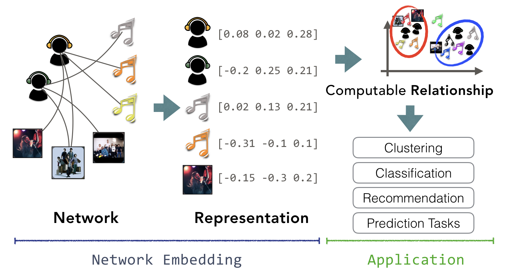

# awesome-network-embedding

Also called network representation learning, graph embedding, knowledge embedding, etc.

The task is to learn the representations of the vertices from a given network.

CALL FOR HELP: I'm planning to re-organize the papers with clear classification index in the near future. Please feel free to submit a commit if you find any interesting related work:)

# Paper References with the implementation(s)

- **REGAL**
  - REGAL: Representation Learning-based Graph Alignment. International Conference on Information and Knowledge Management, CIKM'18
  - [[arxiv]](https://arxiv.org/pdf/1802.06257.pdf)
  - [[paper]](https://dl.acm.org/citation.cfm?id=3271788)
  - [[code]](https://github.com/GemsLab/REGAL)
- **PyTorch Geometric**
  - Fast Graph Representation Learning With PyTorch Geometric
  - [[paper]](https://arxiv.org/pdf/1903.02428.pdf)
  - [[Python PyTorch]](https://github.com/rusty1s/pytorch_geometric)
- **TuckER**
  - Tensor Factorization for Knowledge Graph Completion, Arxiv'19
  - [[paper]](https://arxiv.org/pdf/1901.09590.pdf)
  - [[Python PyTorch]](https://github.com/ibalazevic/TuckER)
- **HypER**
  - Hypernetwork Knowledge Graph Embeddings, Arxiv'18
  - [[paper]](https://arxiv.org/pdf/1808.07018.pdf)
  - [[Python PyTorch]](https://github.com/ibalazevic/HypER)
- **GWNN**
  - Graph Wavelet Neural Network, ICLR'19
  - [[paper]](https://openreview.net/forum?id=H1ewdiR5tQ)
  - [[Python PyTorch]](https://github.com/benedekrozemberczki/GraphWaveletNeuralNetwork)
  - [[Python TensorFlow]](https://github.com/Eilene/GWNN)
- **APPNP**
  - Combining Neural Networks with Personalized PageRank for Classification on Graphs, ICLR'19
  - [[paper]](https://arxiv.org/abs/1810.05997)
  - [[Python PyTorch]](https://github.com/benedekrozemberczki/APPNP)
  - [[Python TensorFlow]](https://github.com/klicperajo/ppnp)
- **role2vec**
  - Learning Role-based Graph Embeddings, IJCAI'18
  - [[paper]](https://arxiv.org/pdf/1802.02896.pdf)
  - [[Python]](https://github.com/benedekrozemberczki/role2vec)
- **AttentionWalk**
  - Watch Your Step: Learning Node Embeddings via Graph Attention, NIPS'18
  - [[paper]](https://arxiv.org/pdf/1710.09599.pdf)
  - [[Python]](http://sami.haija.org/graph/context)
  - [[Python PyTorch]](https://github.com/benedekrozemberczki/AttentionWalk)
  - [[Python TensorFlow]](https://github.com/google-research/google-research/tree/master/graph_embedding/watch_your_step/)
- **GAT**
  - Graph Attention Networks, ICLR'18
  - [[paper]](https://arxiv.org/pdf/1710.10903.pdf)
  - [[Python PyTorch]](https://github.com/Diego999/pyGAT)
  - [[Python TensorFlow]](https://github.com/PetarV-/GAT)
- **SINE**
  - SINE: Scalable Incomplete Network Embedding, ICDM'18
  - [[paper]](https://github.com/benedekrozemberczki/SINE/blob/master/paper.pdf)
  - [[Python PyTorch]](https://github.com/benedekrozemberczki/SINE/)
  - [[C++]](https://github.com/daokunzhang/SINE)
- **SGCN**
  - Signed Graph Convolutional Network, ICDM'18
  - [[paper]](https://github.com/benedekrozemberczki/SGCN/blob/master/sgcn.pdf)
  - [[Python]](https://github.com/benedekrozemberczki/SGCN)
- **TENE**
  - Enhanced Network Embedding with Text Information, ICPR'18
  - [[paper]](https://github.com/benedekrozemberczki/TENE/blob/master/tene_paper.pdf)
  - [[Python]](https://github.com/benedekrozemberczki/TENE) 
- **DANMF**
  - Deep Autoencoder-like Nonnegative Matrix Factorization for Community Detection, CIKM'18
  - [[paper]](https://smartyfh.com/Documents/18DANMF.pdf)
  - [[Python]](https://github.com/benedekrozemberczki/DANMF)
  - [[Matlab]](https://github.com/smartyfh/DANMF)  
- **BANE**
  - Binarized Attributed Network Embedding, ICDM'18
  - [[paper]](https://www.researchgate.net/publication/328688614_Binarized_Attributed_Network_Embedding)
  - [[Python]](https://github.com/benedekrozemberczki/BANE)
  - [[Matlab]](https://github.com/ICDM2018-BANE/BANE)
- **GCN Insights**
  - Deeper Insights into Graph Convolutional Networks for Semi-Supervised Learning, AAAI'18
  - [[Project]](https://liqimai.github.io/blog/AAAI-18/)
  - [[code]](https://github.com/liqimai/gcn/tree/AAAI-18/)
- **PCTADW**
  - Learning Embeddings of Directed Networks with Text-Associated Nodes---with Applications in Software Package Dependency Networks
  - [[paper]](https://arxiv.org/pdf/1809.02270.pdf)
  - [[Python]](https://github.com/shudan/PCTADW)
  - [[dataset]](https://doi.org/10.5281/zenodo.1410669)
- **LGCN**
  - Large-Scale Learnable Graph Convolutional Networks, KDD'18
  - [[paper]](http://www.kdd.org/kdd2018/accepted-papers/view/large-scale-learnable-graph-convolutional-networks)
  - [[Python]](https://github.com/HongyangGao/LGCN)
- **AspEm**
  - AspEm: Embedding Learning by Aspects in Heterogeneous Information Networks
  - [[paper]](http://yushi2.web.engr.illinois.edu/sdm18.pdf)
  - [[Python]](https://github.com/ysyushi/aspem)
- **Walklets**
  - Don't Walk, Skip! Online Learning of Multi-scale Network Embeddings
  - [[paper]](https://arxiv.org/pdf/1605.02115.pdf)
  - [[Python]](https://github.com/benedekrozemberczki/walklets)  
- **gat2vec**
  - gat2vec: Representation learning for attributed graphs
  - [[paper]](https://doi.org/10.1007/s00607-018-0622-9)
  - [[Python]](https://github.com/snash4/GAT2VEC)
- **FSCNMF**
  - FSCNMF: Fusing Structure and Content via Non-negative Matrix Factorization for Embedding Information Networks
  - [[paper]](https://arxiv.org/abs/1804.05313)
  - [[Python]](https://github.com/sambaranban/FSCNMF)  
  - [[Python]](https://github.com/benedekrozemberczki/FSCNMF)
- **SIDE**
  - SIDE: Representation Learning in Signed Directed Networks
  - [[paper]](https://datalab.snu.ac.kr/side/resources/side.pdf)
  - [[Python]](https://datalab.snu.ac.kr/side/resources/side.zip)
  - [[Site]](https://datalab.snu.ac.kr/side/)
- **AWE**
  - Anonymous Walk Embeddings, ICML'18
  - [[paper]](https://www.researchgate.net/publication/325114285_Anonymous_Walk_Embeddings)
  - [[Python]](https://github.com/nd7141/Anonymous-Walk-Embeddings)
- **BiNE**
  - BiNE: Bipartite Network Embedding, SIGIR'18
  - [[paper]](http://www.comp.nus.edu.sg/~xiangnan/papers/sigir18-bipartiteNE.pdf)
  - [[Python]](https://github.com/clhchtcjj/BiNE)
- **HOPE**
  - Asymmetric Transitivity Preserving Graph Embedding
  - [[KDD 2016]](http://www.kdd.org/kdd2016/papers/files/rfp0184-ouA.pdf)
  - [[Python]](https://github.com/AnryYang/HOPE) 
- **VERSE**
  - VERSE, Versatile Graph Embeddings from Similarity Measures
  - [[Arxiv]](https://arxiv.org/abs/1803.04742) [[WWW 2018]]
  - [[Python]](https://github.com/xgfs/verse) 
- **AGNN**
  - Attention-based Graph Neural Network for semi-supervised learning
  - [[ICLR 2018 OpenReview (rejected)]](https://openreview.net/forum?id=rJg4YGWRb)
  - [[Python]](https://github.com/dawnranger/pytorch-AGNN)
- **SEANO**
  - Semi-supervised Embedding in Attributed Networks with Outliers
  - [[Paper]](https://arxiv.org/pdf/1703.08100.pdf) (SDM 2018)
  - [[Python]](http://jiongqianliang.com/SEANO/)   
- **Hyperbolics**
  - Representation Tradeoffs for Hyperbolic Embeddings 
  - [[Arxiv]](https://arxiv.org/abs/1804.03329)
  - [[Python]](https://github.com/HazyResearch/hyperbolics)   
- **DGCNN**
  - An End-to-End Deep Learning Architecture for Graph Classification 
  - [[AAAI 2018]](http://www.cse.wustl.edu/~muhan/papers/AAAI_2018_DGCNN.pdf)
  - [[Lua]](https://github.com/muhanzhang/DGCNN) [[Python]](https://github.com/muhanzhang/pytorch_DGCNN)  
- **structure2vec**
  - Discriminative Embeddings of Latent Variable Models for Structured Data 
  - [[Arxiv]](https://arxiv.org/abs/1603.05629)
  - [[Python]](https://github.com/Hanjun-Dai/pytorch_structure2vec)  
- **Decagon**
  - Decagon, Graph Neural Network for Multirelational Link Prediction 
  - [[Arxiv]](https://arxiv.org/abs/1802.00543) [[SNAP]](http://snap.stanford.edu/decagon/) [[ISMB 2018]]
  - [[Python]](https://github.com/marinkaz/decagon)    
- **DHNE**
  - Structural Deep Embedding for Hyper-Networks
  - [[AAAI 2018]](http://nrl.thumedialab.com/Structural-Deep-Embedding-for-Hyper-Networks)[[Arxiv]](https://arxiv.org/abs/1711.10146)
  - [[Python]](https://github.com/tadpole/DHNE)  
- **Ohmnet**
  - Feature Learning in Multi-Layer Networks 
  - [[Arxiv]](https://arxiv.org/abs/1707.04638) [[SNAP]](http://snap.stanford.edu/ohmnet/) 
  - [[Python]](https://github.com/marinkaz/ohmnet)  
- **SDNE**
  - Structural Deep Network Embedding 
  - [[KDD 2016]](http://www.kdd.org/kdd2016/papers/files/rfp0191-wangAemb.pdf)
  - [[Python]](https://github.com/xiaohan2012/sdne-keras) 
- **STWalk**
  - STWalk: Learning Trajectory Representations in Temporal Graphs] 
  - [[Arxiv]](https://arxiv.org/abs/1711.04150)
  - [[Python]](https://github.com/supriya-pandhre/STWalk)
- **LoNGAE**
  - Learning to Make Predictions on Graphs with Autoencoders 
  - [[Arxiv]](https://arxiv.org/abs/1802.08352)
  - [[Python]](https://github.com/vuptran/graph-representation-learning)  
- **RSDNE**
  - [RSDNE: Exploring Relaxed Similarity and Dissimilarity from Completely-imbalanced Labels for Network Embedding.](https://zhengwang100.github.io/AAAI18_RSDNE.pdf), AAAI 2018
  - [[Matlab]](https://github.com/zhengwang100/RSDNE) 
- **FastGCN**
  - FastGCN: Fast Learning with Graph Convolutional Networks via Importance Sampling 
  - [[Arxiv]](https://arxiv.org/abs/1801.10247), [[ICLR 2018 OpenReview]](https://openreview.net/forum?id=rytstxWAW)
  - [[Python]](https://github.com/matenure/FastGCN) 
- **GEMSEC**
  - [GEMSEC: Graph Embedding with Self Clustering](https://arxiv.org/abs/1802.03997), arXiv 2018
  - [[Python]](https://github.com/benedekrozemberczki/GEMSEC) 
- **diff2vec**
  - [Fast Sequence Based Embedding with Diffusion Graphs](http://homepages.inf.ed.ac.uk/s1668259/papers/sequence.pdf), CompleNet 2018
  - [[Python]](https://github.com/benedekrozemberczki/diff2vec) 
- **Poincare**
  - [Poincaré Embeddings for Learning Hierarchical Representations](https://papers.nips.cc/paper/7213-poincare-embeddings-for-learning-hierarchical-representations), NIPS 2017
  - [[PyTorch]](https://github.com/facebookresearch/poincare-embeddings) [[Python]](https://radimrehurek.com/gensim/models/poincare.html) [[C++]](https://github.com/TatsuyaShirakawa/poincare-embedding)
- **PEUNE**
  - [PRUNE: Preserving Proximity and Global Ranking for Network Embedding](https://papers.nips.cc/paper/7110-prune-preserving-proximity-and-global-ranking-for-network-embedding), NIPS 2017
  - [[code]](https://github.com/ntumslab/PRUNE)
- **ASNE**
  - Attributed Social Network Embedding, arxiv'17
  - [[arxiv]](https://arxiv.org/abs/1706.01860)
  - [[Python]](https://github.com/lizi-git/ASNE)
  - [[Fast Python]](https://github.com/benedekrozemberczki/ASNE)
- **GraphWave**
  - [Spectral Graph Wavelets for Structural Role Similarity in Networks](http://snap.stanford.edu/graphwave/), 
  - [[arxiv]](https://arxiv.org/abs/1710.10321), [[ICLR 2018 OpenReview]](https://openreview.net/forum?id=rytstxWAW)
  - [[Python]](https://github.com/snap-stanford/graphwave) [[faster version]](https://github.com/benedekrozemberczki/GraphWaveMachine)
- **StarSpace**
  - [StarSpace: Embed All The Things!](https://arxiv.org/pdf/1709.03856), arxiv'17
  - [[code]](https://github.com/facebookresearch/Starspace)
- **proNet-core**
  - Vertex-Context Sampling for Weighted Network Embedding, arxiv'17
  - [[arxiv]](https://arxiv.org/abs/1711.00227) [[code]](https://github.com/cnclabs/proNet-core)
- **struc2vec**
  - [struc2vec: Learning Node Representations from Structural Identity](https://dl.acm.org/citation.cfm?id=3098061), KDD'17
  - [[Python]](https://github.com/leoribeiro/struc2vec)
- **ComE**
  - Learning Community Embedding with Community Detection and Node Embedding on Graphs, CIKM'17
  - [[Python]](https://github.com/andompesta/ComE)
- **BoostedNE**
  - [Multi-Level Network Embedding with Boosted Low-Rank Matrix Approximation](https://arxiv.org/abs/1808.08627), '18
  - [[Python]](https://github.com/benedekrozemberczki/BoostedFactorization)  
- **M-NMF**
  - Community Preserving Network Embedding, AAAI'17
  - [[Python]](https://github.com/benedekrozemberczki/M-NMF)
- **GraphSAGE**
  - Inductive Representation Learning on Large Graphs, NIPS'17
  - [[arxiv]](https://arxiv.org/abs/1706.02216) [[TF]](https://github.com/williamleif/GraphSAGE) [[PyTorch]](https://github.com/williamleif/graphsage-simple/) 
- **ICE**
  - [ICE: Item Concept Embedding via Textual Information](http://dl.acm.org/citation.cfm?id=3080807), SIGIR'17
  - [[demo]](https://cnclabs.github.io/ICE/) [[code]](https://github.com/cnclabs/ICE)
- **GuidedHeteEmbedding**
  - Task-guided and path-augmented heterogeneous network embedding for author identification, WSDM'17
  - [[paper]](https://arxiv.org/pdf/1612.02814.pdf) [[code]](https://github.com/chentingpc/GuidedHeteEmbedding)
- **metapath2vec**
  - metapath2vec: Scalable Representation Learning for Heterogeneous Networks, KDD'17
  - [[paper]](https://www3.nd.edu/~dial/publications/dong2017metapath2vec.pdf) [[project website]](https://ericdongyx.github.io/metapath2vec/m2v.html)
- **GCN**
  - Semi-Supervised Classification with Graph Convolutional Networks, ICLR'17
  - [[arxiv]](https://arxiv.org/abs/1609.02907)  [[Python Tensorflow]](https://github.com/tkipf/gcn)
- **GAE**
  - Variational Graph Auto-Encoders, arxiv
  - [[arxiv]](https://arxiv.org/abs/1611.07308) [[Python Tensorflow]](https://github.com/tkipf/gae)
- **CANE**
  - CANE: Context-Aware Network Embedding for Relation Modeling, ACL'17
  - [[paper]](http://www.thunlp.org/~tcc/publications/acl2017_cane.pdf) [[Python]](https://github.com/thunlp/cane)
- **TransNet**
  - TransNet: Translation-Based Network Representation Learning for Social Relation Extraction, IJCAI'17
  - [[Python Tensorflow]](https://github.com/thunlp/TransNet)
- **cnn_graph**
  - Convolutional Neural Networks on Graphs with Fast Localized Spectral Filtering, NIPS'16
  - [[Python]](https://github.com/mdeff/cnn_graph)
- **ConvE**
  - [Convolutional 2D Knowledge Graph Embeddings](https://arxiv.org/pdf/1707.01476v2.pdf), arxiv
  - [[source]](https://github.com/TimDettmers/ConvE)
- **node2vec**
  - [node2vec: Scalable Feature Learning for Networks](http://dl.acm.org/citation.cfm?id=2939672.2939754), KDD'16
  - [[arxiv]](https://arxiv.org/abs/1607.00653) [[Python]](https://github.com/aditya-grover/node2vec) [[Python-2]](https://github.com/apple2373/node2vec) [[Python-3]](https://github.com/eliorc/node2vec) [[C++]](https://github.com/xgfs/node2vec-c)  
- **DNGR**
  - [Deep Neural Networks for Learning Graph Representations](http://www.aaai.org/ocs/index.php/AAAI/AAAI16/paper/view/12423), AAAI'16
  - [[Matlab]](https://github.com/ShelsonCao/DNGR) [[Python Keras]](https://github.com/MdAsifKhan/DNGR-Keras)
- **HolE**
  - [Holographic Embeddings of Knowledge Graphs](http://dl.acm.org/citation.cfm?id=3016172), AAAI'16
  - [[Python-sklearn]](https://github.com/mnick/holographic-embeddings) [[Python-sklearn2]](https://github.com/mnick/scikit-kge)
- **ComplEx**
  - [Complex Embeddings for Simple Link Prediction](http://dl.acm.org/citation.cfm?id=3045609), ICML'16
  - [[arxiv]](https://arxiv.org/abs/1606.06357) [[Python]](https://github.com/ttrouill/complex)
- **MMDW**
  - Max-Margin DeepWalk: Discriminative Learning of Network Representation, IJCAI'16
  - [[paper]](http://nlp.csai.tsinghua.edu.cn/~lzy/publications/ijcai2016_mmdw.pdf)  [[Java]](https://github.com/thunlp/MMDW)
- **planetoid**
  - Revisiting Semi-supervised Learning with Graph Embeddings, ICML'16
  - [[arxiv]](https://arxiv.org/abs/1603.08861) [[Python]](https://github.com/kimiyoung/planetoid)
- **graph2vec**
  - graph2vec: Learning Distributed Representations of Graphs, KDD'17 MLGWorkshop
  - [[arxiv]](https://arxiv.org/abs/1707.05005) [[Python]](https://github.com/benedekrozemberczki/graph2vec)
- **PowerWalk**
  - [PowerWalk: Scalable Personalized PageRank via Random Walks with Vertex-Centric Decomposition](http://dl.acm.org/citation.cfm?id=2983713), CIKM'16
  - [[code]](https://github.com/lqhl/PowerWalk)
- **LINE**
  - [LINE: Large-scale information network embedding](http://dl.acm.org/citation.cfm?id=2741093), WWW'15
  - [[arxiv]](https://arxiv.org/abs/1503.03578) [[C++]](https://github.com/tangjianpku/LINE) [[Python TF]](https://github.com/snowkylin/line) [[Python Theano/Keras]](https://github.com/VahidooX/LINE)
- **PTE**
  - [PTE: Predictive Text Embedding through Large-scale Heterogeneous Text Networks](http://dl.acm.org/citation.cfm?id=2783307), KDD'15
  - [[C++]](https://github.com/mnqu/PTE)
- **GraRep**
  - [Grarep: Learning graph representations with global structural information](http://dl.acm.org/citation.cfm?id=2806512), CIKM'15
  - [[Matlab]](https://github.com/ShelsonCao/GraRep)
- **KB2E**
  - [Learning Entity and Relation Embeddings for Knowledge Graph Completion](http://dl.acm.org/citation.cfm?id=2886624), AAAI'15
  - [[paper]](http://nlp.csai.tsinghua.edu.cn/~lzy/publications/aaai2015_transr.pdf) [[C++]](https://github.com/thunlp/KB2E)  [[faster version]](https://github.com/thunlp/Fast-TransX)
- **TADW**
  - [Network Representation Learning with Rich Text Information](http://dl.acm.org/citation.cfm?id=2832542), IJCAI'15
  - [[paper]](https://www.ijcai.org/Proceedings/15/Papers/299.pdf) [[Matlab]](https://github.com/thunlp/tadw) [[Python]](https://github.com/benedekrozemberczki/TADW)
- **DeepWalk**
  - [DeepWalk: Online Learning of Social Representations](http://dl.acm.org/citation.cfm?id=2623732), KDD'14
  - [[arxiv]](https://arxiv.org/abs/1403.6652) [[Python]](https://github.com/phanein/deepwalk)  [[C++]](https://github.com/xgfs/deepwalk-c)
- **GEM**
  - Graph Embedding Techniques, Applications, and Performance: A Survey
  - [[arxiv]](https://arxiv.org/abs/1705.02801) [[Python]](https://github.com/palash1992/GEM)

# Paper References

[A Comprehensive Survey on Graph Neural Networks](https://arxiv.org/abs/1901.00596), arxiv'19

[Hierarchical Graph Representation Learning with Differentiable Pooling](https://arxiv.org/pdf/1806.08804.pdf), NIPS'18

**SEMAC**, [Link Prediction via Subgraph Embedding-Based Convex Matrix Completion](https://www.aaai.org/ocs/index.php/AAAI/AAAI18/paper/view/16442), AAAI 2018, [Slides](https://www.slideshare.net/gdm3003/semac-graph-node-embeddings-for-link-prediction)

**MILE**, [MILE: A Multi-Level Framework for Scalable Graph Embedding](https://arxiv.org/pdf/1802.09612.pdf), arxiv'18

**MetaGraph2Vec**, [MetaGraph2Vec: Complex Semantic Path Augmented Heterogeneous Network Embedding](https://arxiv.org/abs/1803.02533)

**PinSAGE**, [Graph Convolutional Neural Networks for Web-Scale Recommender Systems](https://arxiv.org/abs/1806.01973)

[Curriculum Learning for Heterogeneous Star Network Embedding via Deep Reinforcement Learning](https://dl.acm.org/citation.cfm?id=3159711), WSDM '18

[Adversarial Network Embedding](https://arxiv.org/abs/1711.07838), arxiv

**Role2Vec**, [Learning Role-based Graph Embeddings](https://arxiv.org/abs/1802.02896)

**edge2vec**, [Feature Propagation on Graph: A New Perspective to Graph Representation
Learning](https://arxiv.org/abs/1804.06111)

**MINES**, [Multi-Dimensional Network Embedding with Hierarchical Structure](http://cse.msu.edu/~mayao4/downloads/Multidimensional_Network_Embedding_with_Hierarchical_Structure.pdf)

[Walk-Steered Convolution for Graph Classification](https://arxiv.org/abs/1804.05837)

[Deep Feature Learning for Graphs](https://arxiv.org/abs/1704.08829), arxiv'17

[Fast Linear Model for Knowledge Graph Embeddings](https://arxiv.org/abs/1710.10881), arxiv'17

[Network Embedding as Matrix Factorization: Unifying DeepWalk, LINE, PTE, and node2vec](https://arxiv.org/abs/1710.02971), arxiv'17

[A Comprehensive Survey of Graph Embedding: Problems, Techniques and Applications](https://arxiv.org/abs/1709.07604), arxiv'17

[Representation Learning on Graphs: Methods and Applications](https://arxiv.org/pdf/1709.05584.pdf), IEEE DEB'17

**CONE**, [CONE: Community Oriented Network Embedding](https://arxiv.org/abs/1709.01554), arxiv'17

**LANE**, 
[Label Informed Attributed Network Embedding](http://dl.acm.org/citation.cfm?id=3018667), WSDM'17

**Graph2Gauss**,
[Deep Gaussian Embedding of Attributed Graphs: Unsupervised Inductive Learning via Ranking](https://arxiv.org/abs/1707.03815), arxiv
[[Bonus Animation]](https://twitter.com/abojchevski/status/885502050133585925)

[Scalable Graph Embedding for Asymmetric Proximity](https://aaai.org/ocs/index.php/AAAI/AAAI17/paper/view/14696), AAAI'17

[Query-based Music Recommendations via Preference Embedding](http://dl.acm.org/citation.cfm?id=2959169), RecSys'16

[Tri-party deep network representation](http://dl.acm.org/citation.cfm?id=3060886), IJCAI'16

[Heterogeneous Network Embedding via Deep Architectures](http://dl.acm.org/citation.cfm?id=2783296), KDD'15

[Neural Word Embedding As Implicit Matrix Factorization](http://dl.acm.org/citation.cfm?id=2969070), NIPS'14

[Distributed large-scale natural graph factorization](http://dl.acm.org/citation.cfm?id=2488393), WWW'13

[From Node Embedding To Community Embedding](https://arxiv.org/abs/1610.09950), arxiv

[Walklets: Multiscale Graph Embeddings for Interpretable Network Classification](https://arxiv.org/abs/1605.02115), arxiv

[Comprehend DeepWalk as Matrix Factorization](https://arxiv.org/abs/1501.00358), arxiv

# Conference & Workshop

[13th International Workshop on Mining and Learning with Graphs](http://www.mlgworkshop.org/2017/), **MLG'17**

[WWW-18 Tutorial Representation Learning on Networks](http://snap.stanford.edu/proj/embeddings-www/), **WWW'18**

# Related List

[awesome-graph-embedding](https://github.com/benedekrozemberczki/awesome-graph-embedding)

[awesome-community-detection](https://github.com/benedekrozemberczki/awesome-community-detection)

[awesome-embedding-models](https://github.com/Hironsan/awesome-embedding-models)

[Must-read papers on network representation learning (NRL) / network embedding (NE)](https://github.com/thunlp/NRLPapers)

[Must-read papers on knowledge representation learning (KRL) / knowledge embedding (KE)](https://github.com/thunlp/KRLPapers)

[Network Embedding Resources](https://github.com/nate-russell/Network-Embedding-Resources)

[awesome-embedding-models](https://github.com/Hironsan/awesome-embedding-models)

[2vec-type embedding models](https://github.com/MaxwellRebo/awesome-2vec)

# Related Project

**Stanford Network Analysis Project** [website](http://snap.stanford.edu/)

